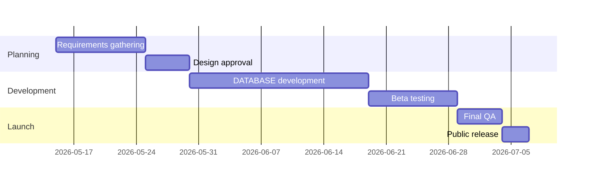

# Project Management Template

## Project Overview
- **Project Name:** REDAPPLE ECOMMERCE PROJECT
- **Status:** [Planning] [Active] [On Hold] [Completed] [Cancelled]
- **Start Date:** 12/03/26
- **Target Completion:** 01/06/26
- **Priority:** [Low] [Medium] [High] [Critical]
- **Tags:** #project #active #programming

## Vision & Goals
### Objective Statement
What problem are we solving? What value are we creating?

### Success Criteria
- [ ] Metric 1: Target value
- [ ] Metric 2: Target value  
- [ ] Qualitative outcome description

## Stakeholders
- **Primary:** 
- **Secondary:** Owner Mwenda 
- **Users/Customers:**
- **Reviewers/Approvers:**

## Scope
### In Scope
- Feature A
- Feature B
- Process Improvement X

### Out of Scope
- Feature C (for future phase)
- Integration Y (post-MVP)

## Timeline & Milestones

## Resources & Budget
- **Team Members:** 1PS
- **Tools & Licenses:** VERCE/ MONGODB
- **Estimated Budget:** $ KES _25,000___
- **Actual Spend:** $ KES _20,000___

## Risk Assessment
| Risk | Probability | Impact | Mitigation Strategy |
|------|-------------|--------|---------------------|
| Technical complexity | Medium | High | Prototyping spike |
| Timeline delay | Low | Medium | Buffer time built in |
| Resource constraints | Medium | Medium | Cross-training |

## Meeting Notes
### [[2026-05-14 Project Kickoff]]
- Decided on tech stack
- Assigned initial tasks
- Set up communication channels

## Related Links
- [[00-Inbox/Ideas]]
- [[02-Areas/Professional Development]]
- External: [Project Management Best Practices](https://example.com)

---

*Template last updated: May 14, 2026*