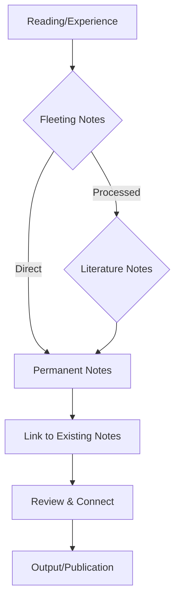

# Knowledge Management System

## Zettelkasten Method Overview
A system for smart note-taking that emphasizes connections between ideas.

### Core Principles
1. **Atomicity** - One idea per note
2. **Autonomy** - Each note should be understandable on its own
3. **Linking** - Explicitly connect related notes
4. **Emergence** - Let structure emerge from connections

## Note Types

### Fleeting Notes
- Quick captures of ideas
- Processed within 24 hours
- Usually deleted or transformed

### Literature Notes
- Notes from reading sources
- Include bibliographic references
- Summarize in your own words

### Permanent Notes (Zettels)
- Fully processed ideas
- Atomic and linked
- Ready for publication/use

## Workflow


## Note Structure
### Zettel Template
```
# Title (descriptive, not just topic)

## Summary
2-3 sentence explanation of the core idea

## Content
- Key point 1
- Key point 2
- Supporting details

## Connections
- [[Related Note 1]]
- [[Related Note 2]]
- See also: [[Broader Concept]], [[Specific Application]]

## Source
- Source: [Book/Article Title] (Author, Year)
- Page: xx
- URL: https://...
```

## Tags vs Links
- **Use links** for direct, meaningful connections between ideas
- **Use tags** for categorization and discovery (#type/concept, #source/book, #project/name)
- Avoid over-tagging; links create richer connections

## Example Zettel
```
# Spaced Repetition Effect

## Summary
The psychological finding that information is better retained when study sessions are spaced out over time rather than crammed together.

## Content
- Ebbinghaus forgetting curve shows rapid decay without review
- Optimal spacing increases with retention interval
- Active recall enhances the spacing effect
- Applications: flashcard systems (Anki), language learning

## Connections
- [[Active Recall]]
- [[Forgetting Curve]]
- [[Learning Techniques]]
- See also: [[Memory]], [[Study Methods]]

## Source
- Source: Make It Stick (Brown, Roediger, McDaniel, 2014)
- Chapter 2
```

## Tools & Setup
### In Obsidian
- Use [[wiki-style links]] extensively
- Enable "Automatically update internal links"
- Use graph view to visualize connections
- Create maps of content (MOCs) for overview notes

### Recommended Plugins
- Dataview (for querying notes)
- Templater (for note templates)
- Obsidian Git (for version control)
- Outliner (for structured notes)

## Maintenance
### Weekly
- Process inbox notes
- Review recent zettels for connections
- Update MOCs if needed

### Monthly
- Review tag usage
- Identify orphaned notes
- Refine linking strategy
- Backup vault

## Related Resources
- [[00-Inbox/Inbox Guidelines]]
- [[01-Projects/Project Management Template]]
- [[04-Archive/Archive Principles]]
- External: [How to Take Smart Notes](https://overleaf.com/read/)

---

*Last updated: May 14, 2026*