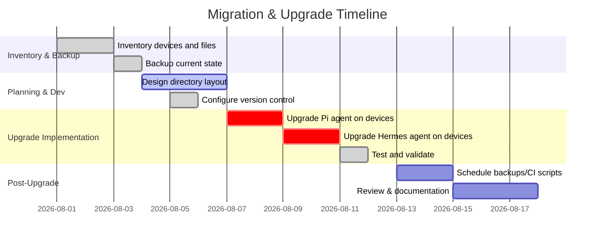

# Developer Workflow with Pi and Hermes Agents (Executive Summary)

We recommend a structured, cross-platform setup that inventories all Pi and Hermes components, centralizes configuration, and applies robust backup/version-control. Key steps include discovering every Pi/Hermes file and service on each device; mapping their config locations (e.g. `~/.pi/agent/settings.json`, `~/.hermes/` on UNIX or `%LOCALAPPDATA%\hermes` on Windows); consolidating configs and secrets in a clear directory tree; and implementing automated CI/CD updates and backups. For example, Pi’s global config lives in `~/.pi/agent/` (with per-project `.pi/` overrides), while Hermes stores all settings under `~/.hermes/` (or `%LOCALAPPDATA%\hermes\` on Windows). We propose using Git for dotfiles, encrypted backups (e.g. via `hermes backup`), and containers/VMs for isolation. The plan covers discovery scripts, a recommended directory layout with sample configs, a migration playbook with rollback, and a backup schedule with encryption and restore tests. 

## Inventory & Discovery Checklist

**Operating system–specific searches.** On Linux/macOS/Raspbian (Raspberry Pi OS), use shell commands to find Pi/Hermes files. For example: 
```bash
# Find Pi config or sessions in user home
find ~ -maxdepth 3 -type d \( -name ".pi" -o -name ".pi/agent" \)
find ~ -maxdepth 2 -type d -name ".hermes" 
```
On Windows (PowerShell), search in `%USERPROFILE%` and `%LOCALAPPDATA%`: 
```powershell
# Windows: find .pi and .hermes in user profile
Get-ChildItem -Path $env:USERPROFILE -Recurse -Directory -Filter ".pi","hermes" -ErrorAction SilentlyContinue
# Check Hermes data at %LOCALAPPDATA%\hermes (default HERMES_HOME)
Get-ChildItem -Path "$env:LOCALAPPDATA\hermes" -Directory
```
**Pi-specific.** Look for `~/.pi/agent/` (global) and any project `.pi/` folders. Pi sessions auto-save to `~/.pi/agent/sessions/` by default. Also check `~/.pi/agent/extensions/`, `skills/`, `prompts/`, `themes/`, and trust records (`~/.pi/agent/trust.json`).  
**Hermes-specific.** By default Hermes homes are in `~/.hermes/` on Linux/macOS or `%LOCALAPPDATA%\hermes\` on Windows. Inside this directory are `config.yaml`, `.env`, `auth.json`, `SOUL.md`, plus subfolders for `memories/`, `skills/`, `cron/`, `sessions/`, `logs/`. Use `hermes config path` to confirm active home. Look for any running Hermes gateway services (e.g. `systemctl` entries or Windows Scheduled Tasks referencing `hermes gateway`).

**Shell commands to inspect.** In addition to searching by filename, check process listings (e.g. `ps aux | grep hermes` or Task Manager) for running Hermes or Pi sessions. Verify environment variables (e.g. `echo $HERMES_HOME`) and installed binaries (`which pi`, `Get-Command hermes`). List active cron jobs (`crontab -l`) for Hermes if scheduled on Linux. On Windows, use `schtasks /Query` or check the Startup folder for Hermes shortcuts. Record all findings in an inventory spreadsheet.

## Configuration Structure & Management

**Pi agent files.** Pi’s global settings live in `~/.pi/agent/settings.json` (JSON format). Project-specific overrides go in `.pi/settings.json` in the project directory (when trusted). Pi auto-loads global prompts: e.g. `~/.pi/agent/AGENTS.md` and `APPEND_SYSTEM.md` are prepended to its system prompt. Sessions and transcripts are saved as JSONL files in `~/.pi/agent/sessions/` (subfolders by cwd). We recommend managing sensitive credentials via environment variables or a `.env` file (Pi supports env vars in its JSON settings). Use Pi’s `/settings` commands or edit `settings.json` directly for model keys, API tokens, etc.

**Hermes agent files.** Hermes stores all configuration under its home directory (by default `~/.hermes/` on UNIX, `%LOCALAPPDATA%\hermes\` on Windows). Notably: `config.yaml` for general settings (providers, models, toolsets, terminal backend, etc.), `.env` for secrets (API keys, bot tokens), and `auth.json` for OAuth tokens. Other files include `SOUL.md` (agent personality), and directories: `memories/` (persistent memory), `skills/`, `cron/` (scheduled jobs), `sessions/` (gateway session tokens), and `logs/` (activity logs with auto-redacted secrets). The `hermes config` commands read/write these files automatically (e.g. `hermes config set OPENROUTER_API_KEY` writes `.env`). Always keep `.env` and `auth.json` out of version control and treat them like vault data.

**Proposed layout.** We suggest a user directory such as:

```bash
~/agents/             # Root for AI agents environment
├── pi-agent/
│   ├── agent/        # Pi global config (will map to ~/.pi/agent)
│   │   ├── settings.json
│   │   ├── AGENTS.md
│   │   ├── APPEND_SYSTEM.md
│   │   ├── trust.json
│   │   ├── sessions/
│   │   ├── extensions/
│   │   ├── skills/
│   │   └── npm/      # local npm install directory for packages
│   └── projects/     # Optional per-project worktrees
│       └── myproject/
│           └── .pi/settings.json
└── hermes-agent/
    ├── profiles/
    │   ├── default/  # Default profile (maps to ~/.hermes)
    │   │   ├── config.yaml
    │   │   ├── .env
    │   │   ├── auth.json
    │   │   ├── SOUL.md
    │   │   ├── memories/
    │   │   ├── skills/
    │   │   ├── cron/
    │   │   ├── sessions/
    │   │   └── logs/
    │   └── work/      # Named profile example
    └── backups/      # Optional: encrypted archives of profiles
```

In this scheme, `~/agents/pi-agent/agent/` can be symlinked as `~/.pi/agent`, and each Hermes profile subfolder as `~/.hermes` (by setting `HERMES_HOME=~/agents/hermes-agent/profiles/default`). This isolates config from user root and enables Git/version control. Sample snippets:

```yaml
# ~/.pi/agent/settings.json (sample)
{
  "defaultModel": "anthropic/claude-opus-4",
  "terminal": {
    "shellPath": "/bin/bash"
  },
  "sessionDir": ".pi/sessions",
  "trust": {
    "defaultProjectTrust": "ask"
  }
}
```

```yaml
# ~/.hermes/config.yaml (sample)
terminal:
  backend: docker
  container_persistent: true

toolsets:
  - web
  - terminal
providers:
  nousportal:
    api_key: ${NOUSPORTAL_API_KEY}
memory:
  file_dir: "memories"
updates:
  pre_update_backup: full
  backup_keep: 3
```

Variables like `${NOUSPORTAL_API_KEY}` are sourced from `.env`. Document each config key in comments or a README.

## Scripts & Automation for Discovery

Provide a step-by-step checklist with scripts/commands for each OS. For example:

- **Linux/macOS/Raspberry Pi**: 
  - Check Pi: `ls ~/.pi/agent/` (settings, sessions), `grep -R "pi-coding-agent" /etc`.
  - Check Hermes: `ls ~/.hermes/` or `hermes config path`.
  - Find services: `systemctl status hermes`, `crontab -l | grep hermes`.
  - List installed Pi packages: `npm list -g --depth=0` or `pi list`.
  - List installed Hermes skills: `hermes skill_manage list`.
- **Windows (PowerShell)**: 
  - Check Pi: ensure Git Bash is installed (per official guide). `Get-Command bash` and `dir $env:USERPROFILE\.pi /AD`.
  - Check Hermes: `Get-Command hermes` (should show `%LOCALAPPDATA%\hermes\hermes-agent\venv\Scripts\hermes.exe`), check `%LOCALAPPDATA%\hermes\` for config.
  - Scheduled Tasks: `schtasks /Query | findstr Hermes`.
- **Common**: Ping each device via SSH/remote to run these commands if needed.

## Containerization and VM Options

For isolation and portability, we recommend containerizing or sandboxing each agent. The Pi docs describe patterns like running Pi inside Docker or using a local micro-VM (“Gondolin”). For example, a Docker setup (from Pi docs) mounts your project into `/workspace` and shares `~/.pi/agent` via a volume. We can also use Pi’s OpenShell sandboxing for policy-controlled execution.

Hermes supports multiple “terminal backends” (local shell, Docker, SSH, Singularity, cloud) for its tool executions. For example, you can configure Hermes to run all shell commands in an isolated Docker container (set `terminal.backend: docker` and `terminal.container_persistent: true` in `config.yaml`) or offload to a remote server over SSH. 

| Approach                | Isolation                    | Setup Complexity          | Overhead      | Use Cases                               |
| ----------------------- | ---------------------------- | ------------------------- | ------------- | --------------------------------------- |
| **Host (no container)** | None (Pi/Hermes run as user) | Easy (no extra layers)    | None          | Quick testing, local dev                |
| **Docker**              | OS-level container           | Moderate (install Docker) | Low–Moderate  | Standard dev, reproducibility           |
| **Gondolin (micro-VM)** | Process-level VM for tools   | Higher (requires QEMU)    | Moderate–High | Strong isolation, even offline          |
| **OpenShell sandbox**   | Policy-controlled sandbox    | High (external service)   | Low–Moderate  | Managed sandbox policies                |
| **Virtual Machine**     | Full OS VM (Hypervisor)      | High (VM setup)           | High          | Maximum isolation (e.g. untrusted code) |

We recommend **Docker** or Pi’s **Gondolin extension** for routine isolation, as supported by Pi’s docs. For Hermes, using the Docker or SSH terminal backend provides similar isolation. Ensure any container has volumes for persistent data (e.g. Pi sessions, Hermes home) and environment variables for credentials. CI/CD pipelines can likewise use Docker images or containers to run Pi/Hermes commands reproducibly.

## CI/CD and Automated Upgrades

Both agents support programmatic control. Pi offers an SDK and JSON-RPC mode for integration, letting you script interactions or build editor plugins. Hermes includes an OpenAI-compatible API server (via `hermes gateway api_server`) for HTTP access, and an ACP (JSON-RPC) mode for IDE integration. Use these to plug into CI pipelines or automation scripts. For example, a GitHub Action could call `hermes acp` to send tasks, or `pi --mode rpc` to send prompts and parse JSON replies.

Use Hermes’ **cron feature** (built into its CLI) to schedule routine tasks: e.g. `hermes cron add 0 3 * * * --prompt="Daily report"` to run every morning. Pi itself has no built-in scheduler, but you can run Pi on a timer via `cron`/`launchd` or systemd. For updates, automate checks: run `hermes update --yes` periodically or use `hermes update --backup` (see below) in a CI job. For Pi, use `npm update -g @earendil-works/pi-coding-agent` or its CLI updater. Always run configuration checks after updates: `hermes config check` and Pi’s `/settings` to migrate new options.

## Backup & Version Control Strategy

**General best practices.** Follow the 3-2-1 backup rule: keep 3 copies of data (original + 2 backups), on 2 different media (local disk, cloud), with ≥1 off-site/off-device. Encrypt all backups of secrets (e.g. `.env`, `auth.json`). Test restores regularly in an isolated environment.

**Hermes-specific.** Use the built-in `hermes backup` command for full agent backups. For example: 
```bash
hermes backup -o ~/Backups/hermes-$(date +%F).zip
```
This archive contains config, memory, sessions, skills, cron jobs and credentials (it excludes code and caches). **Encrypt** the resulting zip as it includes secrets. Verify backups by importing into a fresh HERMES_HOME: `HERMES_HOME=/tmp/test hermes import backup.zip`. Use `hermes profile export` for credential-free moves (omitting `.env`) and `hermes sessions export --redact` for human-readable logs.

Automate Hermes backups with a script or cron job: schedule `hermes backup` to run (e.g. nightly), retain a rotating window (e.g. 7 days), and log failures. For CI/CD, include `hermes backup --quick` before any major update or deployment. Configure Hermes’ `updates` in `config.yaml` to auto-keep 5 full backups and do “quick” snapshots by default. Always test restore as part of deployment verification.

**Pi-specific.** Pi does not have a built-in backup command, but session files and settings (in `~/.pi/agent/`) should be backed up like any other user data. Commit non-sensitive dotfiles (`~/.pi/agent/settings.json`, extensions, `AGENTS.md`) to Git in a private repo or sync via a service. Store Pi session JSONL or exported transcripts (HTML/JSONL via `/export`) in version control if desired. For automated backup, tools like `rsync`, Borg, or Restic can snapshot the `~/.pi` directory. Ensure device backups include Pi’s config folder and any project `.pi` subfolders. 

**Comparison of backup tools:** 

| Tool          | Type                   | Cross-Platform                | Encryption          | Notes                           |
| ------------- | ---------------------- | ----------------------------- | ------------------- | ------------------------------- |
| BorgBackup    | Dedup backup repo      | Linux/macOS (Windows via WSL) | Yes                 | Efficient, but single-host repo |
| Restic        | Dedup backup repo      | Linux/macOS/Win               | Yes                 | Supports multi-host repo, easy  |
| Duplicity     | Encrypted (rsync-like) | All                           | Yes                 | Good for cloud targets          |
| Arq           | Proprietary (GUI/CLI)  | All                           | Yes                 | User-friendly GUI, costs        |
| Rclone (copy) | File sync to cloud     | All                           | Yes (if configured) | Syncs to AWS/S3/etc             |

Choose based on platform and team skill. For cross-device syncing of config (not backups), also consider tools like Syncthing or Dropbox for the agent directories, but never sync the raw `.env` unencrypted.

## Migration/Upgrade Playbook

1. **Baseline and Backup:** Before changes, run full backups of all agents. For Hermes, use `hermes backup`. For Pi, tar or copy `~/.pi/agent` and project `.pi` dirs. Verify backups by testing `hermes import` in a sandbox.
2. **Version Control:** Initialize Git repos for dotfiles (Pi/Hermes configs). Add modules excluding secrets (`.env`/`auth.json`). Use `.gitignore` on any sensitive files. Push to a private remote if available.
3. **Review Config Differences:** Use `hermes config check` and `pi config` (or diff `settings.json`) to identify new options when upgrading versions. Merge any legacy settings into the new recommended format.
4. **Upgrade Agents:** Upgrade Pi (e.g. `npm install -g @earendil-works/pi-coding-agent`) on each machine. For Hermes, use `hermes update` or reinstall via the installer. Use non-interactive mode with `--yes` after backups. Monitor for any prompts about config changes.
5. **Run Pre-update Snapshots:** Hermes can automatically snapshot state before updating (`updates.pre_update_backup`). Ensure it’s enabled for critical systems. Similarly, snapshot Pi sessions by copying the JSONL folder.
6. **Smoke Test:** After upgrade, run each agent with a simple prompt or command to confirm it starts correctly. For Hermes, use `hermes doctor` and test one or two tool calls (e.g. `/tools list`). For Pi, start a session and use `/settings` or run a brief code completion.
7. **Rollback Plan:** If upgrade fails, restore from backup. Hermes allows `/rollback` inside a session to revert file changes, but the safer method is a fresh home import. Pi sessions can be resumed from older JSONL files. Keep a restore-tested backup copy offline for worst-case recovery.
8. **Documentation Update:** Update any internal documentation (README, wikis) with new commands or changes. Tag release versions in your repos.



## Backup Plan Details

- **Retention:** Keep at least 3–5 recent full backups (Hermes’ `backup_keep` setting). For longer history, rotate monthly or yearly snapshots off-site. Pi backups can follow a similar rotation (e.g. weekly diffs, monthly full archives).
- **Encryption:** Always encrypt backup archives (e.g. using `gpg` or encrypted disk) because they contain secrets. Limit file permissions (`chmod 600`) on backups.
- **Verification:** Monthly, perform a restore drill: import the latest Hermes backup to a scratch `HERMES_HOME` and run `hermes doctor`. For Pi, try resuming a saved session or running `pi -r`.
- **Automated tasks:** On Linux, use `cron` or systemd timers to run backup scripts. On Windows, use Task Scheduler. The Hermes cron system itself can remind or manage backup jobs.
- **Storage:** Use a mix of local and remote. For example, push encrypted backup files to an S3 bucket or remote NAS. Ensure at least one copy is off-site/cloud.

## Security & Access Control

Store only non-sensitive configs in VCS. Manage API keys through environment variables or secure vaults. On multi-user systems, restrict home directory permissions. Use container/VM isolation to prevent the agent from modifying host beyond its sandbox. For Hermes, enable command approval workflows (`command.whitelist`/`blacklist`) and use its built-in security features. Monitor logs (`~/.hermes/logs/`) for unauthorized access. Pi has no built-in auth, so rely on OS user permissions for its config directory.

## Logging & Monitoring

Hermes produces logs in `logs/errors.log` and `logs/gateway.log`. Include these in your backup scope for incident forensics. For proactive monitoring, consider scripts that check if the Hermes gateway is running (e.g. `ps aux | grep hermes`, or `gateway status`). Pi produces session transcripts (JSONL). Logging is manual (you can export sessions to HTML). Centralize logs with a tool like the ELK stack or local log rotator. Document where to find error traces and session histories for audits.

## Documentation Practices

Maintain clear README files outlining this setup. For each agent, include a summary of config files and locations. Use in-line comments in `config.yaml` and `settings.json` where possible. Keep this research document as an internal wiki or markdown in the repo. Automate generation of agent documentation if available (e.g. Pi’s `--help` and Hermes’ `--help` commands). Encourage team members to update docs when adding new skills or tools.

## Tools & References

Use official sources whenever possible. Key references include:
- **Pi documentation** (pi.dev): covers installation, settings, containerization.
- **Hermes docs** (hermes-agent.nousresearch.com): covers config, CLI commands, backup, integration.
- **Hermes Setup Guides** (hermes-agent.ai): practical how-tos for backup/import.
- **GitHub repos**: e.g. `earendil-works/pi` (for Pi agent), `NousResearch/hermes-agent` (for Hermes code and examples).
- **Books/Blogs**: The 2026 “Hermes Practitioner’s Reference” by Blake Crosley (for best practices).

For version control, use **Git** (Bitbucket/GitHub/GitLab). For containerization, use **Docker** or **Podman**. For backups, consider **Borg** or **Restic** (CLI), or **Duplicati/Arq** (GUI). For automation, use **Ansible** or CI pipelines (GitHub Actions, GitLab CI) to run `hermes`/`pi` commands. Compare options in tables below:

| Task/Tool           | Cross-OS Options          | Notes/Use Case               |
|---------------------|---------------------------|------------------------------|
| Shell/config sync   | GNU Stow, Chezmoi, rcm    | Symlink dotfiles, OS-agnostic |
| Secrets management  | Direnv, Vault, gpg-encrypt| Inject env vars to Pi/Hermes |
| Backup              | Restic, Borg, Duplicity   | CLI tools; restic for cloud   |
| Containerization    | Docker, Podman, Singularity | Docker is standard           |
| VM/hypervisor       | VirtualBox, QEMU/KVM      | Full VM for untrusted code    |
| CI/CD               | GitHub Actions, Jenkins   | Schedule backups, update jobs |
| Monitoring          | Prometheus + Grafana, or simple scripts | Track process uptime/logs    |

By following this comprehensive plan—inventory, centralized config, automated workflows, and strict backup/version practices—you ensure that your Pi and Hermes agents can be used safely and reliably across devices, with clear upgrade and rollback procedures. 

**Sources:** Official Pi and Hermes documentation and repos, supplemented by community guides and best-practice references.
