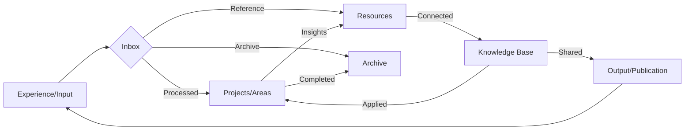

# Main Dashboard

## Vault Overview
This is your primary knowledge vault organized using the PARA method:
- **Projects** - Short-term efforts with definite goals
- **Areas** - Ongoing responsibilities requiring maintenance
- **Resources** - Reference materials and knowledge bases
- **Archive** - Inactive items kept for reference

## Quick Navigation
### Core Sections
- [[00-Inbox|📥 Inbox]]
- [[01-Projects|🎯 Projects]]
- [[02-Areas|⚖️ Areas]]
- [[03-Resources|📚 Resources]]
- [[04-Archive|📦 Archive]]

### Specialized Domains
- [[05-AI-Research|🤖 AI Research]]
- [[06-Math|🔢 Mathematics]]
- [[07-Cybersecurity|🔒 Cybersecurity]]
- [[08-Daily|📅 Daily Notes]]
- [[09-Knowledge|💡 Knowledge & Interdisciplinary]]
- 🇨🇳[[chinese]]

## Daily Actions
### Morning Routine
1. Review [[00-Inbox|Inbox]]
2. Check calendar and today's priorities
3. Update [[08-Daily/Daily Note Template|Today's Note]]

### Evening Routine
1. Process inbox to zero
2. Review accomplishments
3. Plan tomorrow's top 3 priorities
4. Brief journaling/reflection

### Weekly Review (Friday/Sunday)
- [[ ]] Review all projects status
- [[ ]] Check areas for needed attention
- [[ ]] Process and organize notes
- [[ ]] Update knowledge connections
- [[ ]] Clean and backup vault
- [[ ]] Set intentions for coming week

## Knowledge Flow

## Current Focus Areas
- **Active Projects:** 
  - [ ] 
  - [ ] 
  - [ ]
- **Key Areas Needing Attention:**
  - Health & Wellness
  - Professional Development
  - Financial Management
- **Learning Topics:**
  - [[05-AI-Research/AI Fundamentals]]
  - [[06-Math/Mathematics for ML]]
  - [[09-Knowledge/Interdisciplinary Connections]]

## Vault Statistics
*Note: Update these periodically*
- Total Notes: ~XX
- Project Notes: XX
- Area Notes: XX
- Resource Notes: XX
- Archive Notes: XX
- Tags Used: XX
- Links Created: XX

## Maintenance Commands
### Daily
- Process inbox
- Update daily note
- Brief review of active projects

### Weekly
- Full review using template
- Update project statuses
- Check area metrics
- Knowledge connection mapping

### Monthly
- Deep archive review
- Knowledge base consolidation
- Skill assessment and planning
- Backup verification

### Quarterly
- Goals and OKRs review
- Systems and processes evaluation
- Major life area assessment
- Vault structure optimization

## Quick Links to Templates
- [[01-Projects/Project Management Template]]
- [[02-Areas/Areas Overview]]
- [[03-Resources/Knowledge Management System]]
- [[04-Archive/Archive Principles]]
- [[08-Daily/Daily Note Template]]
- [[09-Knowledge/Interdisciplinary Connections]]

## Inspiration & Motivation
> "The beautiful thing about learning is that nobody can take it away from you."
> ― B.B. King

> "Knowledge is of no value unless you put it into practice."
> ― Anton Chekhov

> "The only true wisdom is in knowing you know nothing."
> ― Socrates

> "Stay hungry, stay foolish."
> ― Steve Jobs

---

*Last updated: May 14, 2026*
*This dashboard serves as your entry point to the knowledge vault. Modify as your needs evolve.*